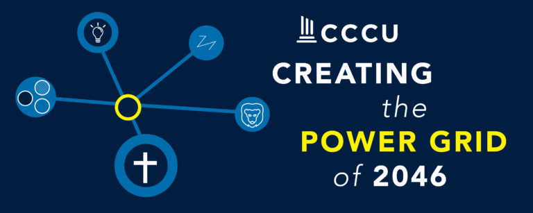

---?image=white

@title[Introduction]



## Practical Windows 10:
### Making sense of the new paradigm

---

@title[whoami]

# Who Am I?

```powershell
(Get-Item Presenter:\MichaelDavis).Synopsis
```

@fa[university]Director for User Support & Engagement at LeTourneau University
@fa[twitter][@mdavis332](https://twitter.com/mdavis332) 
@fa[terminal](contributor to open source PowerShell projects)
@fa[cubes](user of SCCM since 2007)
@fa[paragraph](and fan of the oxford comma)

---

# New Paradigm?

+++

## New Paradigm

> ... Windows 10 is the last version of Windows ...
> - [Jerry Nixon, Microsoft](https://channel9.msdn.com/Events/Ignite/2015/BRK2352)

+++

## We've always done it that way

New Windows, new way of thinking